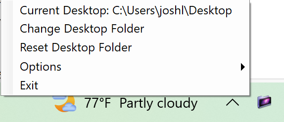

# Temp Desktop
This is a program for temporarily changing the folder that windows uses for the Desktop UI. I find this useful when working in a particular folder for long periods of time, where normally I would need to keep the File explorer open. 

It lives in the system tray and works by simply editing the Registry key that sets your desktop folder and optionally copying all public desktop shortcuts to a backup folder to hide them temporarily. 

## Usage
1. Install [.NET 8](https://dotnet.microsoft.com/en-us/download/dotnet/8.0)
2. Download the [latest release](https://github.com/giplgwm/Temporary-Desktop/releases/latest) of Temp Desktop
3. Extract the folder
4. Run `Temp Desktop.exe` and the Temp Desktop icon will appear in your system tray
5. Right click the icon in the tray to open the menu
6. Press `Change Desktop Folder` and select the folder you'd like to use.
7. When you're done working in the temporary desktop folder, choose `Reset Desktop Folder` or simply click `Exit` with the "Reset desktop on app close" option enabled (it is by default).

### Notes
- If hide shortcuts is enabled in options, public desktop shortcuts will be moved from C:\Users\Public\Desktop to C:\Users\Public\Desktop_backup. This keeps them from showing on the new desktop screen, they are moved back to the appropriate folder when the desktop is reset either by pressing the button or closing the application with the reset on close option enabled.
- The program requires admin access due to the above note, since adding files to C:\Users\Public\Desktop requires elevated priveledges.
